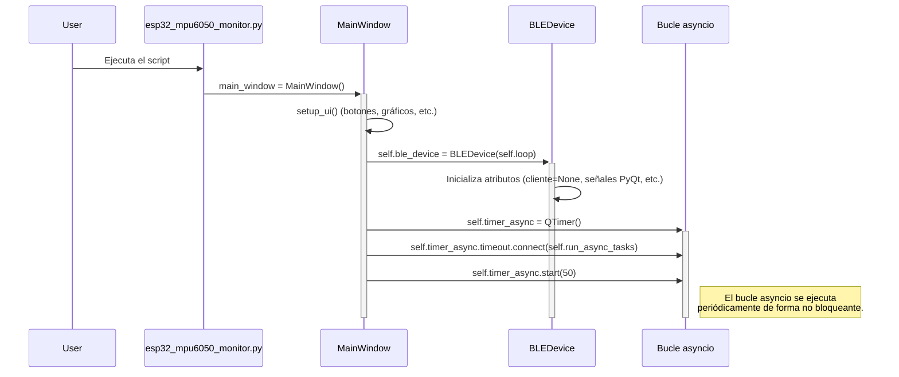
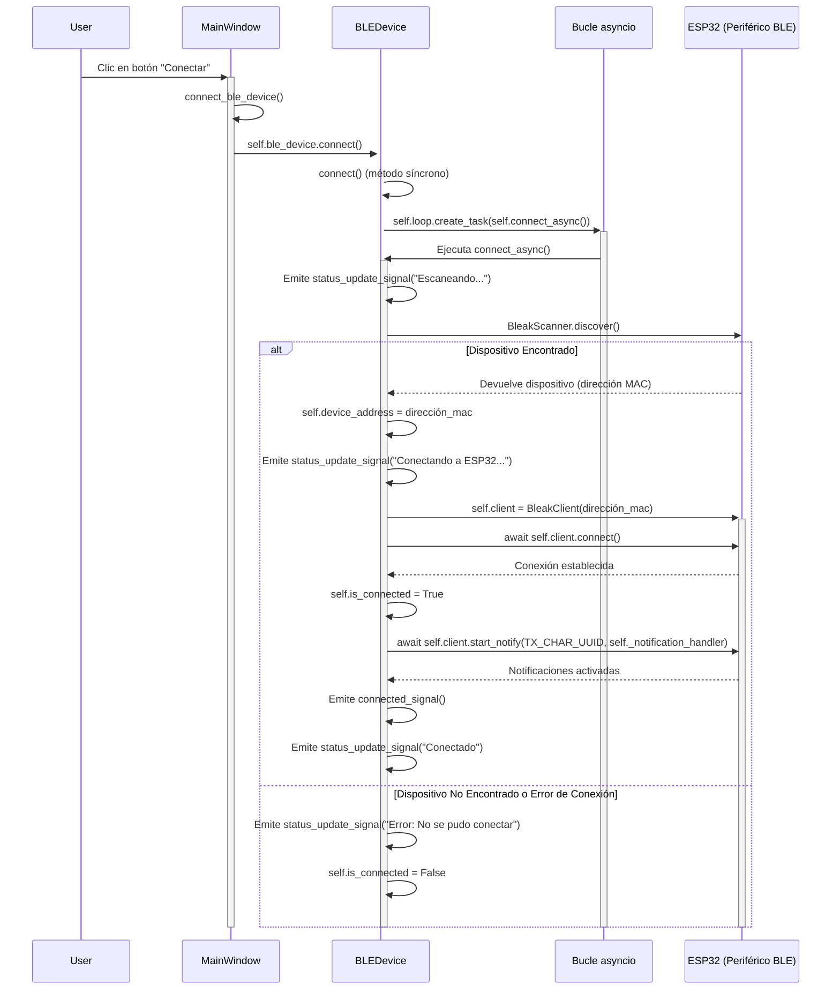
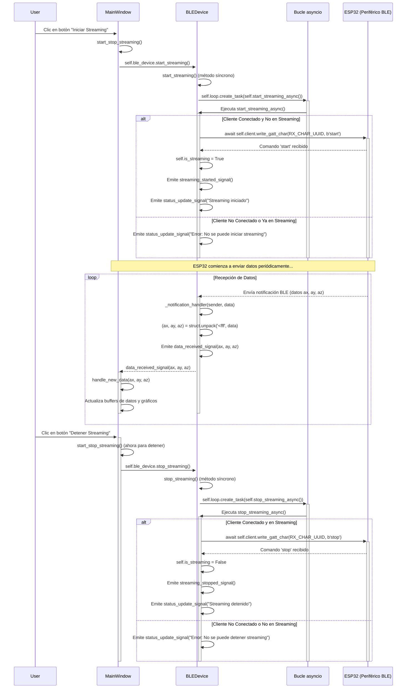
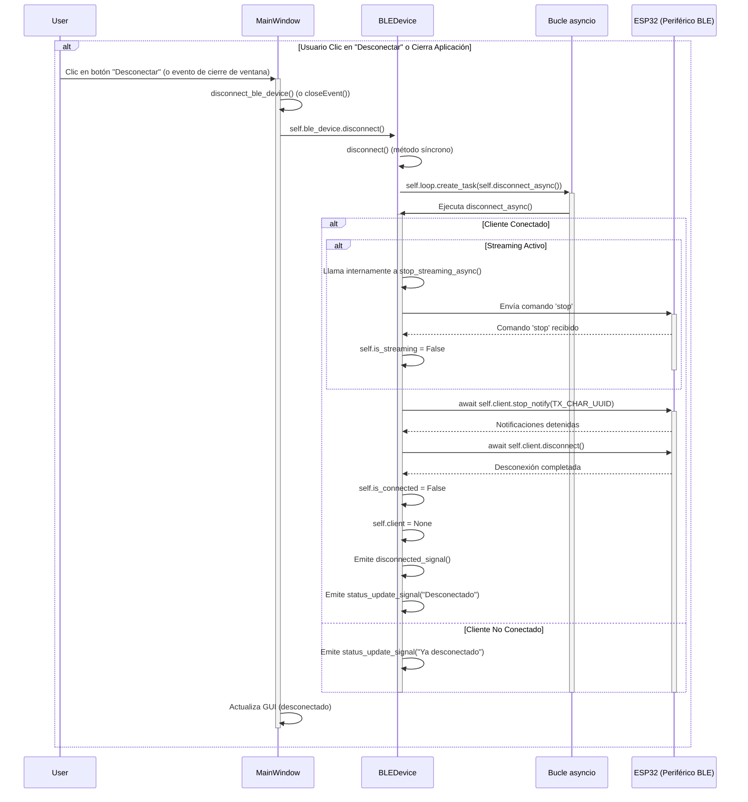
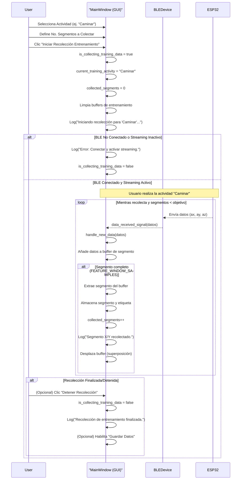
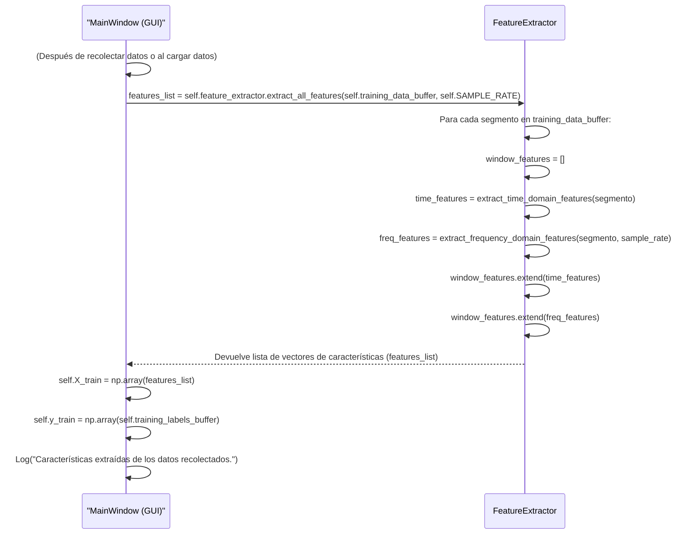
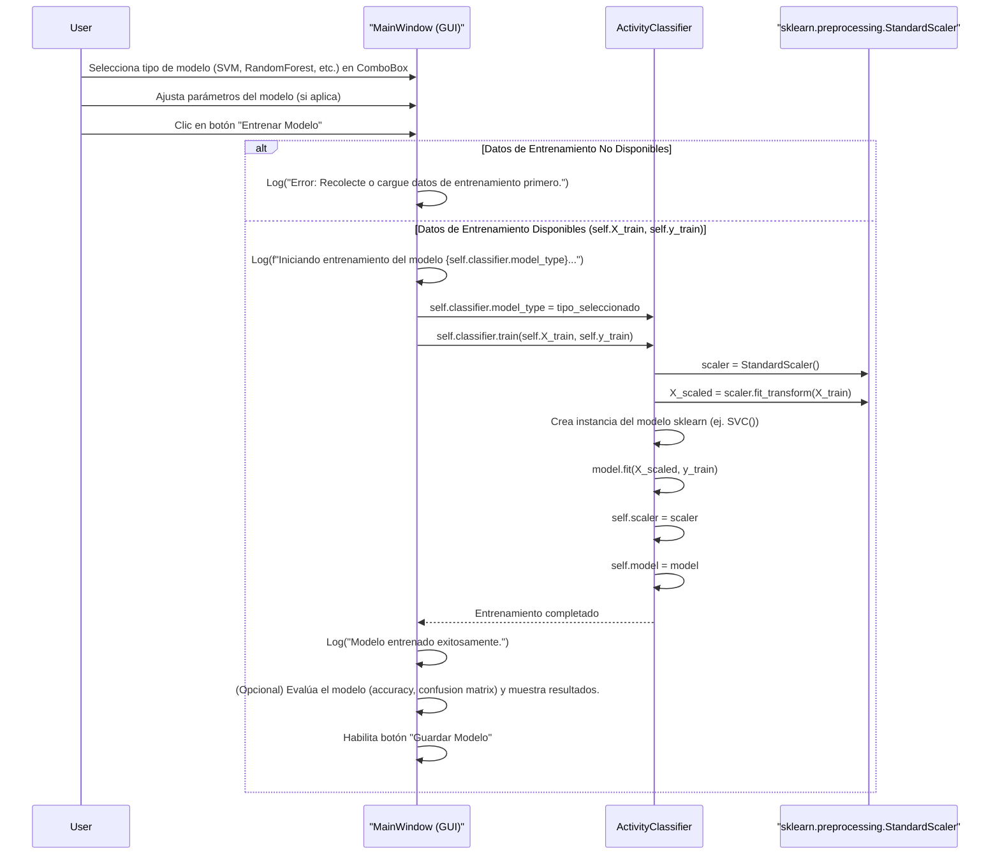
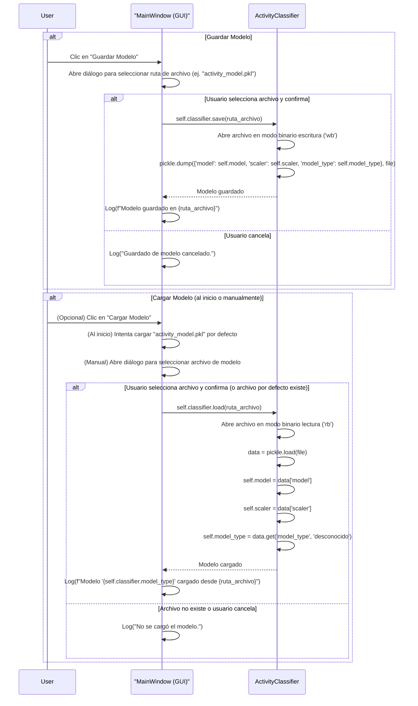
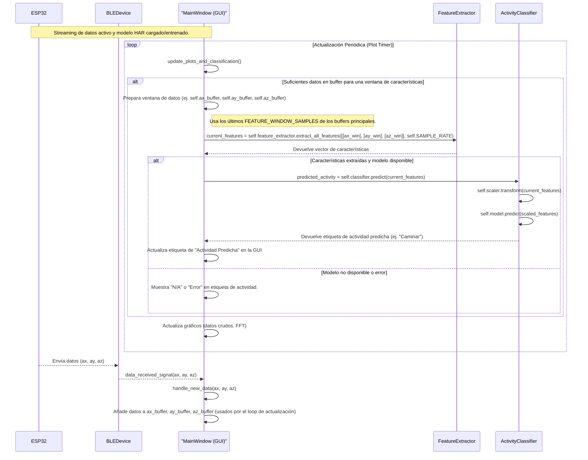

# Tutorial: Monitor de Acelerómetro ESP32-MPU6050 con BLE

## 1. Introducción

Bienvenido al proyecto de monitorización de datos del acelerómetro MPU6050 desde un ESP32. Este sistema está diseñado para conectar un ESP32 (que ejecuta MicroPython y lee un sensor MPU6050) a una aplicación de escritorio Python vía Bluetooth Low Energy (BLE) para visualizar los datos del acelerómetro en tiempo real.

Este tutorial te guiará a través de dos aspectos principales:
1.  **Cómo gestionar el código del proyecto utilizando Git y GitHub/GitLab.**
2.  **Cómo configurar, utilizar y entender la interfaz `esp32_mpu6050_monitor.py` y su componente clave para la comunicación BLE, la clase `BLEDevice`.**

El proyecto se centra principalmente en el script `esp32_mpu6050_monitor.py`, que proporciona una interfaz gráfica para:
*   Escanear y conectarse a un dispositivo ESP32 específico.
*   Recibir datos del acelerómetro (ax, ay, az) transmitidos por BLE.
*   Visualizar estos datos en gráficos en tiempo real.
*   Controlar el inicio y la detención del flujo de datos desde el ESP32.

---


## 2. Entendiendo y Utilizando la Interfaz `esp32_mpu6050_monitor.py`

Esta aplicación de escritorio Python te permite conectar y visualizar datos de un acelerómetro MPU6050 que está siendo leído por un ESP32 y transmitido vía Bluetooth Low Energy (BLE).

### 2.1. Configuración del Entorno

**A. Requisitos de Software (Python y Librerías):**
*   Python 3.7 o superior.
*   Las siguientes librerías de Python:
    *   `PyQt5`: Para la interfaz gráfica de usuario (GUI).
    *   `pyqtgraph`: Para los gráficos en tiempo real.
    *   `bleak`: Para la comunicación Bluetooth Low Energy asíncrona.
    *   `numpy`: Para el manejo eficiente de arrays de datos (aunque su uso directo en este script es mínimo, es común en el ecosistema).

**B. Instalación de Dependencias:**
Se recomienda crear un entorno virtual para tu proyecto.
```bash
python -m venv env
# Activar el entorno:
# Windows:
env\Scripts\activate
# macOS/Linux:
source env/bin/activate
```
Luego, instala las librerías. Si tienes un archivo `requirements.txt` similar a este:
```
PyQt5
pyqtgraph
bleak
numpy
```
Instálalas con:
```bash
pip install -r requirements.txt
```
O individualmente:
```bash
pip install PyQt5 pyqtgraph bleak numpy
```

**C. Requisitos de Hardware:**
*   Un ESP32 que tenga **cargado y ejecutándose el script `src_py/main.py`** (incluido en la carpeta `src_py` de este proyecto). Este script es esencial ya que se encarga de leer los datos del sensor MPU6050 y gestionar toda la comunicación BLE desde el ESP32. El ESP32 debe estar programado para:
    *   Lea datos de un sensor MPU6050 conectado vía I2C.
    *   Anuncie un servicio BLE con un nombre específico (definido como `ESP32_DEVICE_NAME` en `esp32_mpu6050_monitor.py`).
    *   Tenga una característica BLE para transmitir los datos del acelerómetro (UUID definido como `TX_CHAR_UUID`).
    *   Tenga una característica BLE para recibir comandos (UUID definido como `RX_CHAR_UUID`, ej. 'start', 'stop').
*   Un adaptador Bluetooth en tu PC compatible con BLE.

### 2.2. Funcionamiento Detallado de `esp32_mpu6050_monitor.py` (Diagramas Mermaid)

Esta sección detalla el funcionamiento interno de la aplicación `esp32_mpu6050_monitor.py` utilizando diagramas de secuencia Mermaid para ilustrar los flujos clave.

#### 2.2.1. Componentes Principales e Inicialización

Este diagrama muestra la creación e inicialización de los componentes principales de la aplicación: `MainWindow` (la interfaz gráfica) y `BLEDevice` (el manejador de la comunicación BLE), junto con el bucle de eventos `asyncio` que gestiona las operaciones asíncronas.



#### 2.2.2. Proceso de Conexión BLE

Este diagrama ilustra la secuencia de eventos cuando el usuario inicia una conexión BLE con el ESP32.



#### 2.2.3. Proceso de Streaming de Datos (Inicio, Recepción y Detención)

Este diagrama muestra cómo se inicia el flujo de datos desde el ESP32, cómo se reciben y procesan los datos, y cómo se detiene el flujo.



#### 2.2.4. Proceso de Desconexión BLE

Este diagrama detalla la secuencia de eventos cuando el usuario se desconecta del dispositivo BLE o cierra la aplicación.



### 2.3. Reconocimiento de Actividad Humana (HAR) en la Aplicación

La aplicación `esp32_mpu6050_monitor.py` no solo visualiza datos del acelerómetro, sino que también incluye un sistema completo para el Reconocimiento de Actividad Humana (HAR). Esto implica recolectar datos, extraer características, entrenar un modelo de clasificación y utilizarlo para predecir actividades en tiempo real.

#### 2.3.1. Recolección de Datos y Etiquetado para Entrenamiento

Este diagrama muestra cómo el usuario recolecta datos para una actividad específica, que luego se usarán para entrenar el modelo.



#### 2.3.2. Extracción de Características

Una vez recolectados los segmentos de datos crudos, se extraen características significativas que el modelo de ML pueda utilizar.



#### 2.3.3. Entrenamiento del Modelo de Clasificación

Con las características extraídas (X_train) y sus etiquetas (y_train), se entrena un modelo de clasificación.



#### 2.3.4. Guardado y Carga del Modelo Entrenado

Los modelos entrenados pueden guardarse para uso futuro y cargarse al iniciar la aplicación.



#### 2.3.5. Predicción/Clasificación en Tiempo Real

Una vez que hay un modelo cargado o entrenado, la aplicación puede clasificar la actividad en tiempo real a medida que llegan nuevos datos del sensor.



---


## 3. Contribuyendo al Proyecto 

Si quieres que otros contribuyan:

*   **Forking (Bifurcación):** Los colaboradores pueden "bifurcar" tu repositorio en GitHub, creando su propia copia.
*   **Branches (Ramas):** Crear ramas para nuevas características o correcciones (`git checkout -b nombre-rama`).
*   **Pull Requests (Solicitudes de Extracción):** Una vez que los cambios están listos en su rama, pueden enviar un "Pull Request" al repositorio original para que revises e integres sus cambios.

---

## 4. Conclusión

Este tutorial te ha proporcionado las bases para gestionar el código del proyecto con Git y para entender la arquitectura y el funcionamiento de la interfaz `esp32_mpu6050_monitor.py`, con un enfoque en la comunicación BLE gestionada por la clase `BLEDevice`. ¡Esperamos que sea de gran utilidad para tus experimentos de visualización de datos de sensores!

No dudes en expandir este tutorial con más detalles específicos de tu implementación o problemas comunes que encuentres.
